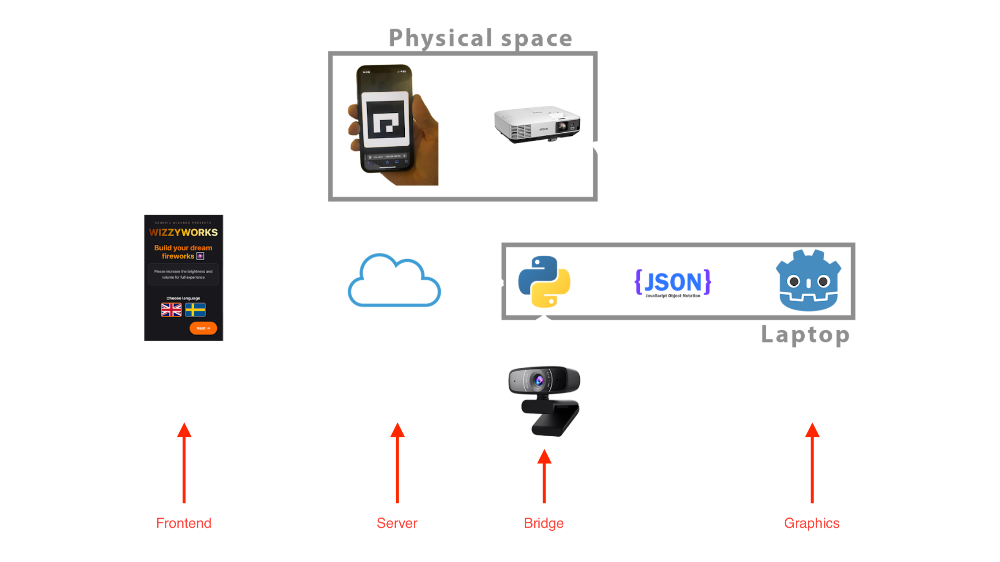

# WizzyWorks

An immersive interactive fireworks experience where visitors design custom fireworks on their smartphones and launch them onto a large screen using AR marker detection.

## Overview

WizzyWorks allows visitors to:
1. **Design**: Scan a QR code and customize up to 9 fireworks through shapes, colors, or freehand drawing
2. **Position**: Place their phone on the floor in front of a large screen
3. **Launch**: Tap to ignite the firework and watch it launch from their phone's position into the big screen display

The system uses camera-based AR marker detection to determine phone positions and generate synchronized firework visualizations.

## System Architecture

WizzyWorks consists of four interconnected modules:



### Modules

1. **[wizzyworks-frontend](https://github.com/Generic-Wizard-DH2413/wizzyworks-frontend)** - React web app for mobile phones where users design fireworks
2. **[wizzyworks-server](https://github.com/Generic-Wizard-DH2413/wizzyworks-server)** - WebSocket server that relays messages between components
3. **[wizzyworks-bridge](https://github.com/Generic-Wizard-DH2413/wizzyworks-bridge)** - Python bridge that detects ArUco markers and generates firework data
4. **[wizzyworks-graphics](https://github.com/Generic-Wizard-DH2413/wizzyworks-graphics)** - Godot engine visualization that renders the fireworks

## Getting Started

### Clone the Repository

This project uses Git submodules to manage the four interconnected modules. You can clone the project in two ways:

#### Option 1: Clone with Submodules (Recommended)

Clone the main repository with all submodules in one command:

```bash
git clone --recurse-submodules https://github.com/Generic-Wizard-DH2413/wizzyworks.git
cd wizzyworks
```

If you've already cloned without submodules, initialize them:

```bash
git clone https://github.com/Generic-Wizard-DH2413/wizzyworks.git
cd wizzyworks
git submodule update --init --recursive
```

#### Option 2: Clone Modules Manually

Alternatively, clone each module separately:

```bash
# Create project directory
mkdir wizzyworks
cd wizzyworks

# Clone each module
git clone https://github.com/Generic-Wizard-DH2413/wizzyworks-frontend.git
git clone https://github.com/Generic-Wizard-DH2413/wizzyworks-server.git
git clone https://github.com/Generic-Wizard-DH2413/wizzyworks-bridge.git
git clone https://github.com/Generic-Wizard-DH2413/wizzyworks-graphics.git
```

### Prerequisites

- **Node.js 18+** (for frontend)
- **Docker** (for server, or Python 3.8+ if running locally)
- **Python 3.8+** (for bridge)
- **Godot Engine 4.4+** (for graphics)
- **Webcam** (for ArUco marker detection)

### Setup Instructions

#### 1. Server (WebSocket Communication Hub)

**Using Docker (Recommended):**
```bash
cd wizzyworks-server
docker-compose up -d
```

**Or locally:**
```bash
cd wizzyworks-server
pip install -r requirements.txt
cd server
python server.py
```

Server will run on:
- WebSocket: `ws://localhost:8765`
- Health check: `http://localhost:8000/health`

See [wizzyworks-server/README.md](https://github.com/Generic-Wizard-DH2413/wizzyworks-server/blob/main/README.md) for details.

#### 2. Graphics (Firework Visualization)

```bash
cd wizzyworks-graphics/godot-visuals
```

1. Open Godot Engine 4.4+
2. Import the `godot-visuals` project
3. Open `scenes/testing_environment.tscn`
4. Press F5 to run

See [wizzyworks-graphics/README.md](https://github.com/Generic-Wizard-DH2413/wizzyworks-graphics/blob/main/README.md) for controls and details.

#### 3. Bridge (ArUco Marker Detection)

```bash
cd wizzyworks-bridge
pip install -r requirements.txt

# Copy and configure environment variables
cp .env.example .env
# Edit .env to set:
# - WEBSOCKET_URI (server address)
# - SAVE_DIR (path to wizzyworks-graphics/godot-visuals/json_fireworks)

python main.py
```

See [wizzyworks-bridge/README.md](https://github.com/Generic-Wizard-DH2413/wizzyworks-bridge/blob/main/README.md) for configuration options.

#### 4. Frontend (Mobile Web App)

```bash
cd wizzyworks-frontend
npm install

# For local development
npm run dev -- --host

# Access from mobile at http://<YOUR_IP>:5173
```

See [wizzyworks-frontend/README.md](https://github.com/Generic-Wizard-DH2413/wizzyworks-frontend/blob/main/README.md) for deployment options.

## Development Workflow

1. **Start the Server** first to enable communication
2. **Start the Graphics** engine to display fireworks
3. **Start the Bridge** to detect phone markers
4. **Access the Webapp** from a mobile device to design fireworks

## Testing

Each module can be tested independently:

- **Server**: Check health endpoint at `http://localhost:8000/health`
- **Graphics**: Use keyboard controls (F, M, L) to load test fireworks
- **Bridge**: Use included `test_server.py` for WebSocket testing
- **Frontend**: Access directly via browser

## Project Information

**Course**: DH2413 Advanced Graphics and Interaction  
**Institution**: KTH Royal Institute of Technology  
**Year**: 2025

## Module Documentation

For detailed setup, configuration, and development information for each module, please refer to their respective README files:

- [Server Documentation](https://github.com/Generic-Wizard-DH2413/wizzyworks-server/blob/main/README.md)
- [Graphics Documentation](https://github.com/Generic-Wizard-DH2413/wizzyworks-graphics/blob/main/README.md)
- [Bridge Documentation](https://github.com/Generic-Wizard-DH2413/wizzyworks-bridge/blob/main/README.md)
- [Frontend Documentation](https://github.com/Generic-Wizard-DH2413/wizzyworks-frontend/blob/main/README.md)

## Troubleshooting

- **Camera not detected**: Check permissions and camera index in bridge configuration
- **WebSocket connection failed**: Ensure server is running and firewall allows connections
- **Fireworks not appearing**: Verify bridge `SAVE_DIR` points to graphics `json_fireworks` folder
- **Mobile can't connect**: Ensure devices are on same network and use correct IP address
